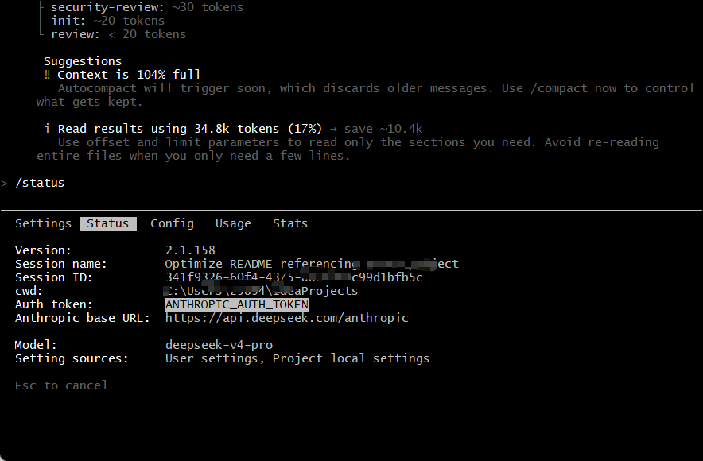
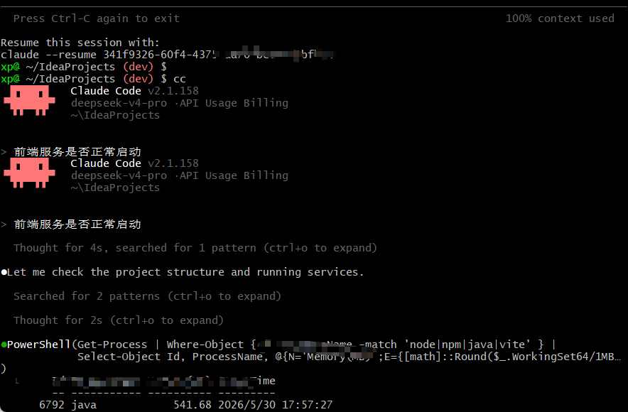

# Vibe Coding 完整教程：零基础用 AI 搭建 Web 项目

> 这份教程教你如何用 AI（Claude Code + DeepSeek）从零搭建一个能卖钱的 Web 项目。不需要编程基础。

配套项目源码：[README.md](./README.md)

---

## 目录

1. [什么是 Vibe Coding](#1-什么是-vibe-coding)
2. [环境搭建（一次性，10 分钟）](#2-环境搭建一次性10-分钟)
3. [第一个项目（跟着做，5 分钟）](#3-第一个项目跟着做5-分钟)
4. [怎么跟 AI 对话（技巧进阶）](#4-怎么跟-ai-对话技巧进阶)
5. [真实案例：本项目完整开发过程](#5-真实案例本项目完整开发过程)
6. [创建你的 CLAUDE.md](#6-创建你的-claudemd)
7. [部署上线 + 安全检查](#7-部署上线--安全检查)

---

## 1. 什么是 Vibe Coding

Vibe Coding（氛围编程）的核心思想：**你描述想要什么，AI 负责全部编码。你只需要验证效果对不对。**

```
传统开发：想清楚怎么做 → 手写每行代码 → 调试改 Bug → 写文档
Vibe Coding：说想要什么 → AI 写全部代码 → 运行看效果 → 不对就让它改
```

### 你需要什么

- 能清楚描述想要什么（比如"做一个能登录注册的任务管理网站"）
- 能判断功能是否符合预期（跑起来点一点就行，不需要看懂代码）
- 愿意试错（效果不对就告诉 AI 哪里不对）

### 你不需要什么

不需要背框架 API、不需要手写 SQL/CSS/XML、不需要提前画类图或 ER 图、不需要会 Linux。

> **想直接运行本项目源码？** 除了 AI 编程环境，你还需要 JDK、MySQL、Redis、Maven。完整清单见 [README.md 前置准备](./README.md#前置准备)。本文聚焦 Vibe Coding 方法本身。

---

## 2. 环境搭建（一次性，10 分钟）

只需三样东西：**Node.js ≥ 18**、**Claude Code**、**DeepSeek API Key**（10 元够用）。装一次，永久使用。

### 2.1 安装 Node.js

打开 PowerShell：

```powershell
node -v
```

如果显示版本号 ≥ 18，跳过。否则去 [nodejs.org](https://nodejs.org/) 下载 LTS 版安装。

### 2.2 安装 Claude Code

```powershell
npm install -g @anthropic-ai/claude-code
claude --version    # 验证安装成功
```

### 2.3 注册 DeepSeek + 配置

1. 打开 [platform.deepseek.com](https://platform.deepseek.com) → 注册 → **API Keys** → 创建 Key → **充值 10 元**
2. 用记事本打开 `C:\Users\<你的用户名>\.claude\settings.json`（没有就新建）：

```json
{
  "env": {
    "ANTHROPIC_BASE_URL": "https://api.deepseek.com/anthropic",
    "ANTHROPIC_AUTH_TOKEN": "你的DeepSeek API Key",
    "ANTHROPIC_MODEL": "deepseek-v4-pro",
    "ANTHROPIC_DEFAULT_OPUS_MODEL": "deepseek-v4-pro",
    "ANTHROPIC_DEFAULT_SONNET_MODEL": "deepseek-v4-pro",
    "ANTHROPIC_DEFAULT_HAIKU_MODEL": "deepseek-v4-flash",
    "CLAUDE_CODE_SUBAGENT_MODEL": "deepseek-v4-pro",
    "API_TIMEOUT_MS": "600000",
    "CLAUDE_CODE_EFFORT_LEVEL": "max"
  }
}
```

配置详情参考 [DeepSeek 官方指南](https://api-docs.deepseek.com/zh-cn/quick_start/agent_integrations/claude_code)。

> **重要**：DeepSeek V4-Pro 是纯文本模型，不能识别图片。你不能截图给 AI 让它照着做——只能用文字描述。如需图片识别，切回 Claude 原生模型。

---

## 3. 第一个项目（跟着做，5 分钟）

环境搭好了，现在手把手走一遍完整流程。记住这个节奏，以后每个项目都这么干。

### 步骤 1：创建项目文件夹

```powershell
mkdir my-first-project
cd my-first-project
```

### 步骤 2：启动 Claude Code

```powershell
claude
```

终端会进入 Claude Code 交互界面，看到 `>` 提示符就表示就绪。

### 步骤 3：验证环境

在 `>` 后面输入：

```
/status
```

确认输出中包含 `model: deepseek-v4-pro`。如果不是，回到第 2 节检查配置。

<p align="center">
  
</p>
<p align="center"><em>/status 确认模型为 deepseek-v4-pro</em></p>

### 步骤 4：说出你的第一句话

现在把你想做的项目描述给 AI。**说需求，不说技术方案**。选一个：

**A. 有明确想法：**
```
帮我创建一个 [项目类型]，技术栈 Spring Boot + Vue 3。
核心功能：1.XXX  2.XXX  3.XXX。数据库 MySQL，缓存 Redis。
```

**B. 先练手：**
```
帮我创建一个任务管理 Web 应用。能添加任务、标记完成、按日期筛选、
搜索标题。后端 Spring Boot，前端 Vue 3，数据库 MySQL。
```

**C. 经典起步项目：**
```
帮我创建一个个人博客系统。发布文章（标题+正文）、分类、标签、
评论、后台管理。前端 Vue 3，后端 Spring Boot，数据库 MySQL。
```

说出去之后，AI 就开始干活了——创建文件、写代码。你看着就行。

<p align="center">
  
</p>
<p align="center"><em>Claude Code 对话示例——你说需求，AI 生成全部代码</em></p>

### 步骤 5：运行看效果

AI 写完代码后，启动项目看看：

```bash
npm install && npm run dev     # 前端
# 浏览器打开提示的地址（通常是 http://localhost:5173）
```

点一点、用一用，感受哪些地方符合预期、哪些不对。

### 步骤 6：不满意就改

效果不对怎么办？**继续在 Claude Code 里说**。AI 记得之前的所有对话。

```
首页太单调了，加个头图和项目简介区域。
登录页加个"记住密码"选项。
把所有错误提示改成中文。
```

改完再跑一次，满意为止。

### 步骤 7：保存你的代码

```bash
git init
git add -A
git commit -m "第一版——核心功能跑通"
```

**这是最重要的习惯**：每完成一个功能就 commit 一次。万一 AI 后面改坏了，你可以 `git reset --hard` 一键回退，而不是从头再来。

---

## 4. 怎么跟 AI 对话（技巧进阶）

跑通了第一个项目，现在升级你的对话技巧。

### 核心原则

**说需求，不说实现。** 你管"要什么效果"，AI 管"用什么技术"。

| 错误（说实现） | 正确（说需求） |
|--------------|--------------|
| "用策略模式实现多模型切换" | "支持多个 AI 模型，切换要方便，以后可能加新的" |
| "建表，字段 id、content、role" | "每条消息要存下来，知道谁发的、发的什么、什么时间" |
| "加个拦截器校验 token" | "没登录的人访问后台接口要提示登录" |

### 通用公式

```
[在哪] + [干什么] + [限制条件] + [期望效果]
```

```
"这个 Spring Boot 项目，加上 AI 对话功能，用流式输出、模型可切换，
 前端要 ChatGPT 那种打字机效果。"
```

### 四类任务模板

**从零开始**。说清楚三件事：项目类型 + 技术栈 + 3~5 个核心功能。

```
帮我做一个进销存管理系统，后端 Spring Boot、前端 Vue 3。
核心功能：商品入库、出库、库存查询、出入库记录。
```

**加新功能**。一次只加一个，加完 commit 再加下一个。

```
给商品管理加个批量导入功能，支持上传 Excel 文件。
```

**全局修改**。说清楚范围——"全部"还是"只改某页"。

```
把所有按钮统一成蓝色圆角风格，全局生效。
```

**写脚本**。描述流程——先干嘛、再干嘛、结果怎样。

```
写个一键启动脚本，先检测数据库是否运行，没运行就启动，
让用户选启动哪些服务，最后打印访问地址。
```

### 踩坑速查

| 问题 | 解法 |
|------|------|
| AI 改太多半对半错 | 拆成小需求，每次 commit 再继续 |
| AI 编造不存在的类 | CLAUDE.md 加"禁止编造不存在的类或方法" |
| AI 理解错了 | `git reset --hard` 回退，换说法重来 |
| 代码跑不起来 | **把报错信息直接贴给 AI**，它自己会修 |
| 风格不一致 | CLAUDE.md 补充规则 |

### 建议节奏

```
第 1 次：跑通核心流程（CRUD 就行，丑没关系）
第 2 次：加搜索、筛选、分页
第 3 次：优化界面（Loading / 错误提示 / 空状态 / 移动端）
第 4 次：工程收尾（.gitignore、启动脚本、文档）
```

每次不超过半小时，结束就 commit。

---

## 5. 真实案例：本项目完整开发过程

15 次对话、不到 2 天、不到 5 元，产出 86 个 Java 类 + 50+ 前端组件 + 30 张表 + 4 份文档。

### 对话实录

| # | 我说了什么 | AI 产出了什么 | 耗时 |
|---|----------|-------------|------|
| 1 | 创建 Spring Boot + Vue 后台管理系统，有用户、角色、菜单管理 | 项目骨架 + 9 张 RBAC 表 + JWT 认证 + 16 个接口 + Vue 后台 | 40min |
| 2 | 清理编译文件，配 .gitignore | .gitignore + 清理 Git 追踪 | 5min |
| 3~12 | 加 AI 对话——多模型、SSE 流式、会话、知识库、助手模板（10 次，每次加一个功能） | AiChatService + 5 个 Provider + 7 张 AI 表 + SSE + Chat 组件 | 6h |
| 13 | 加 RAG 检索、中英文切换、收藏分享、AI 管理后台 | rag/ 包（10 文件）+ vue-i18n + 收藏/分享 + 模型管理 | 2h |
| 14 | Vite 允许局域网访问 | 2 行配置 | 3min |
| 15 | 一键启动脚本，检测 MySQL/Redis，公网穿透 | start-all.sh（240 行）+ stop-all.sh + bat | 30min |

### 参考了哪些文档

每次对话只给 AI **自然语言需求 + 少量文档片段**，没给任何现成代码：

| 对话主题 | 参考的片段 | AI 据此做了什么 |
|---------|-----------|---------------|
| RBAC 权限 | 一份后台管理系统的功能列表 | 设计 9 张表、JWT 认证、16 个接口 |
| AI 对话 | DeepSeek API 的请求/响应格式（几行 JSON） | 写 OkHttp 调用、SSE 解析、前端打字机 |
| 后台界面 | Element UI 组件列表 | 拼出完整 CRUD 页面 |
| 全流程 | CLAUDE.md | 遵守命名规范、分层架构 |

### AI 自主选择的设计

我一句没指定，AI 自己选的：

| 需求 | AI 选的方案 | 原因 |
|------|-----------|------|
| 5 个 AI 厂商切换 | 策略模式 + 抽象工厂 | 加新厂商只需 30 行 |
| 向量存储（开发/生产） | 接口抽象双实现 | 开发零配置，上线一行切换 |
| AI 对话实时输出 | SSE（非 WebSocket） | 更简单，够用 |
| Vue 2/3 共存 | 自动匹配 Pinia / Vuex | 按版本选最佳 |

### 效率对比

| 模块 | 手写预估 | AI 实际 | 提效 |
|------|---------|--------|------|
| 后端（86 类） | 6 周 | 约 1 天 | ×30 |
| 前端（50+ 组件） | 4 周 | 约半天 | ×40 |
| 数据库（30 表） | 3 天 | 2 小时 | ×12 |
| 文档（5000+ 行） | 1 周 | 2 小时 | ×20 |
| **总计** | **2-3 个月** | **不到 2 天** | **×30+** |

---

## 6. 创建你的 CLAUDE.md

AI 每次对话会先读项目根目录的 `CLAUDE.md`，把它当作"编码规范说明书"。项目初期不写也行，等发现 AI 风格不对时再加规则。

在项目根目录新建 `CLAUDE.md`：

```markdown
# 开发规范
1. 注释和文档用简体中文，代码和变量名用英文
2. Java 类名大驼峰、方法名小驼峰、缩进 4 空格
3. 禁止 System.out，用 SLF4J
4. 分层：Controller → Service → Mapper → Entity
5. 禁止凭空编造不存在的类或方法
```

完整版见本项目 [CLAUDE.md](./CLAUDE.md)。不用一次写全——**什么时候发现 AI 风格有问题，什么时候加一条**。积累几次对话后，AI 的输出质量会越来越稳定。

---

## 7. 部署上线 + 安全检查

### 环境要求

详见 [README 前置准备](./README.md#前置准备)，完整清单：JDK ≥ 1.8 · MySQL ≥ 5.7 · Redis ≥ 3.0 · Maven ≥ 3.0 · Node.js ≥ 18 · Git

### 本地启动

详细步骤见 [README.md 快速开始](./README.md#快速开始)，这里简要列出：

```bash
# 1. 导入数据库（含建库、30 张表、初始数据）
mysql -u root -p < spring-boot-admin/src/main/resources/sql/schema.sql

# 2. 启动全部服务（交互式选择）
bash start-all.sh              # 在 Git Bash 中运行
# 或双击 start-services.bat    # CMD 备选

# 3. 访问
# http://localhost:5174   → AI 用户端
# http://localhost:5173   → 管理后台
# http://localhost:8090/doc.html → 接口文档
```

内置账号：`admin/admin123` · `user/user123`

> **启动前必读**：`start-all.sh` 中硬编码了作者本机的 JDK/Maven 路径，你需要先改成自己的路径。详见 [README 前置准备第 4 步](./README.md#4-修改启动脚本中的路径重要)。
>
> 遇到报错？查看 [README 常见问题](./README.md#常见问题)。

### 公网访问

1. 下载 [cloudflared.exe](https://github.com/cloudflare/cloudflared/releases) 到用户目录
2. 运行 `bash start-all.sh`，选第 4 项
3. 获得 `https://xxxx.trycloudflare.com` 公网地址

其他方案（ngrok/frp/ZeroTier）见 [技术文档](./项目技术文档.md)。

### 上线前 8 项检查

| # | 检查项 | 通过标准 |
|---|--------|---------|
| 1 | 登录保护 | 不登录访问 → 跳转登录页 |
| 2 | 密码安全 | 数据库密码是 BCrypt 密文 |
| 3 | XSS 防护 | `<script>alert(1)</script>` 不被执行 |
| 4 | 防暴力破解 | 输错 5 次密码暂时锁定 |
| 5 | 操作审计 | 日志可查谁在什么时间做了什么 |
| 6 | 界面完整 | 有 Loading / 错误提示 / 空状态 |
| 7 | 跨域安全 | CORS 白名单而非 `*` |
| 8 | 文档保护 | 生产环境 Swagger 关闭或需登录 |

---

> 不到 2 天 + 5 块钱 = 一个可商用 Web 系统。现在搭环境，打开 PowerShell，输入 `claude`，说第一句话。
