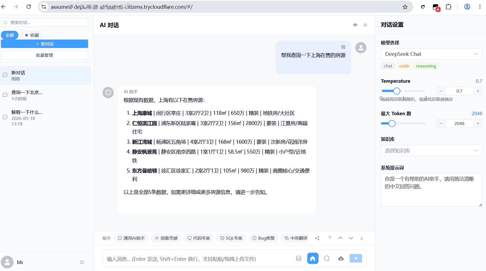
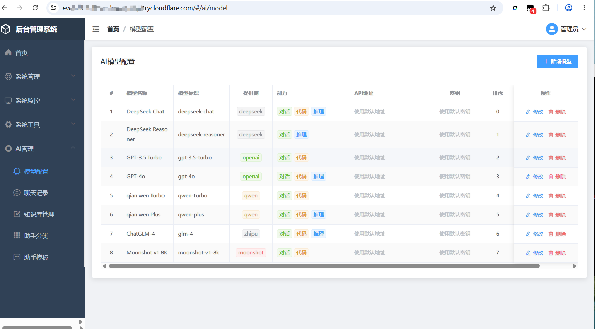

# Ds-Ai：Vibe Coding 实战项目

> 一个功能完备的 AI 聊天平台，**100% 由 AI 对话生成，零手写代码**。总成本不到 2 天 + 5 块钱。

[](https://gitee.com/xp_s/vibeCoding)
[](https://spring.io/projects/spring-boot)
[](https://vuejs.org/)
[](https://claude.ai/code)

---

## 这是什么

一个多模块 AI 聊天平台，含 30 项功能、86 个 Java 类、50+ 前端组件、30 张数据库表。代码全部由 Claude Code + DeepSeek 通过对话生成。

**但它更重要的价值是一份教程**——从零搭建 AI 编程环境到交付商用级项目，每一步的操作方法都记录在 [GUIDE.md](./GUIDE.md) 中。

<p align="center">
  
  &nbsp;&nbsp;
  
</p>
<p align="center"><em>左：AI 用户端聊天界面 &nbsp;|&nbsp; 右：管理后台界面</em></p>

---

## 前置准备

> **以下操作如无特别说明，均在 PowerShell 中执行**（Win+R → 输入 `powershell` → 回车）。启动服务时会用到 Git Bash，后面会单独说明。

### 1. 环境清单

打开 PowerShell，逐条粘贴验证命令。显示版本号 = 已装，提示"不是内部命令" = 需要安装：

| 工具 | 最低版本 | 在 PowerShell 中输入 | 下载 |
|------|---------|---------------------|------|
| JDK | ≥ 1.8 | `java -version` | [Adoptium](https://adoptium.net/) |
| MySQL | ≥ 5.7 | `mysql --version` | [MySQL Community](https://dev.mysql.com/downloads/) |
| Redis | ≥ 3.0 | `redis-server --version` | [Redis for Windows](https://github.com/tporadowski/redis/releases) |
| Maven | ≥ 3.0 | `mvn --version` | [Maven](https://maven.apache.org/download.cgi) |
| Node.js | ≥ 18 | `node -v` | [Node.js](https://nodejs.org/) |
| Git | 任意 | `git --version` | [Git for Windows](https://git-scm.com/) |

> **注意**：安装 Git for Windows 时会自带 **Git Bash**。安装完成后，在项目文件夹空白处右键 → **Git Bash Here** 即可打开。后面启动脚本需要用它。

### 2. 克隆项目

```powershell
git clone https://gitee.com/xp_s/vibeCoding.git
cd vibeCoding
```

> 之后所有命令都在 `vibeCoding` 项目根目录下执行。用 `pwd`（PowerShell）确认当前路径。

### 3. 安装前端依赖

`node_modules` 未入库，clone 后必须手动安装。确保当前在项目根目录 `vibeCoding` 下：

```powershell
# 安装 vue-admin（管理后台）的依赖
cd vue-admin
npm install
cd ..

# 安装 ds_ai_web（AI 用户端）的依赖
cd ds_ai_web
npm install
cd ..
```

> 如果下载慢，先在 PowerShell 中执行换源（只需执行一次）：
> ```powershell
> npm config set registry https://registry.npmmirror.com
> ```

### 4. 修改启动脚本中的路径（重要）

`start-all.sh` 和 `start-services.bat` 里硬编码了作者本机的 JDK/Maven 路径，你需要改成自己的。

用记事本或 VS Code 打开 `start-all.sh`，修改第 7-8 行：

```bash
# 改前（作者本机路径，你跑必报错）
MAVEN_HOME="D:/devTool-2022-new/apache-maven-3.6.3"
JAVA_HOME="D:/devTool-2022-new/jdk"

# 改后（换成你自己的安装路径，注意用正斜杠 /）
MAVEN_HOME="C:/apache-maven-3.9.6"        # 你的 Maven 路径
JAVA_HOME="C:/Program Files/Java/jdk-17"  # 你的 JDK 路径
```

> 如何找到你的 JDK/Maven 路径？在 PowerShell 中执行 `where java` 和 `where mvn`，根据输出路径往上找安装目录。
>
> 如果 `java` 和 `mvn` 已配好系统环境变量（where 有输出），直接把第 6-10 行简化为一行 `MVN=mvn`，删掉 `export` 那几行即可。

---

## 快速开始

### 1. 导入数据库

SQL 文件位置：`spring-boot-admin/src/main/resources/sql/schema.sql`（含建库、30 张表、初始数据）

**方式一：命令行**（PowerShell / CMD 均可，在项目根目录下执行）

```powershell
mysql -u root -p < spring-boot-admin/src/main/resources/sql/schema.sql
```

> `-u root -p` 表示用 root 账号、密码稍后输入。如果 root 没有密码，直接回车即可。如果 MySQL 账号不是 root，把 `root` 换成你的账号。

**方式二：客户端**
用 Navicat / DBeaver / HeidiSQL 等工具，新建连接 → 新建数据库 `ai_test`（字符集 utf8mb4）→ 右键"运行 SQL 文件"→ 选择 `schema.sql` 导入。

### 2. 启动服务

**方式 A：Git Bash（推荐）**——打开 Git Bash，在项目根目录下执行：

```bash
bash start-all.sh
```

**方式 B：CMD**——直接双击 `start-services.bat`，会在三个独立窗口中启动服务。

> 两种方式效果相同，选一个即可。启动脚本会交互式询问你要启动哪些服务。

### 3. 访问

| 地址 | 说明 |
|------|------|
| http://localhost:5174 | AI 用户端 |
| http://localhost:5173 | 管理后台 |
| http://localhost:8090/doc.html | 接口文档（Swagger） |

内置账号：`admin` / `admin123` 和 `user` / `user123`

---

## 模块概览

| 模块 | 技术栈 | 端口 |
|------|--------|------|
| spring-boot-admin | Spring Boot 2.7 + MyBatis + Redis + MySQL | 8090 |
| ds_ai_web | Vue 3.5 + Element Plus + Pinia + Vite | 5174 |
| vue-admin | Vue 2.7 + Element UI + Vuex + Vite | 5173 |

**功能清单**：RBAC 权限管理(8) · 系统监控(6) · 代码生成器 · AI 多模型对话(SSE) · RAG 检索 · 联网搜索 · 文档解析 · 知识库 · 助手模板 · 国际化 · 收藏分享

---

## 项目结构

```
├── spring-boot-admin/     # 后端（31 Controller + 20 Mapper + 22 Entity）
├── ds_ai_web/             # AI 用户端 Vue 3（17 组件 + 8 Store）
├── vue-admin/             # 管理后台 Vue 2
├── GUIDE.md               # 完整教程——从零用 AI 搭建项目的每一步
├── CLAUDE.md              # AI 编码规范
├── start-all.sh / stop-all.sh / start-services.bat
└── 项目技术文档.md / API.md / ARCHITECTURE.md
```

---

## 文档导航

| 想要什么 | 看哪个 |
|---------|--------|
| 学会用 AI 从零搭建项目 | [GUIDE.md](./GUIDE.md) —— 完整教程 |
| 了解项目架构和数据库设计 | [技术文档](./项目技术文档.md) |
| 查 API 接口 | [API 文档](./spring-boot-admin/API.md) |
| 看认证流程和数据流 | [架构文档](./spring-boot-admin/ARCHITECTURE.md) |
| 复制 AI 编码规范 | [CLAUDE.md](./CLAUDE.md) |

---

## 常见问题

### 启动报错 'java'/'mvn' 不是内部命令？
JDK/Maven 未安装或环境变量未配置。在 PowerShell 中执行 `java -version` 和 `mvn --version` 自查。如果确实装了但脚本报错，检查 `start-all.sh` 中的 `JAVA_HOME` 和 `MAVEN_HOME` 路径是否正确。

### 前端页面空白或报错？
大概率是没装依赖。确认 `vue-admin/node_modules` 和 `ds_ai_web/node_modules` 目录存在，不存在则在项目根目录打开 PowerShell 执行：

```powershell
cd vue-admin
npm install
cd ..
cd ds_ai_web
npm install
cd ..
```

### 数据库连接失败？
- MySQL 服务是否启动？（任务管理器 → 服务 → 查找 MySQL）
- 导入时 `-u root -p` 表示用 root + 密码，如果 root 有密码但导入时直接回车，会认证失败
- 确认已先执行导入 SQL 文件

### 端口被占用？
在 PowerShell 中执行：

```powershell
netstat -ano | Select-String "8090|5173|5174"
```
找到占用进程 PID 后，在任务管理器中结束，或修改 `application.yml` / `vite.config.js` 中的端口。

### Redis 未运行？
- Windows 用户下载 [Redis for Windows](https://github.com/tporadowski/redis/releases)，双击 `redis-server.exe` 启动
- `start-all.sh` 会尝试自动启动 Redis，但需要 `redis-server.exe` 在正确路径（默认 `D:/devTool-2022-new/Redis-x64-3.0.504/`，你需要在脚本中改成自己的路径）

### npm install 太慢或报错？
在 PowerShell 中先换国内源（只需执行一次）：

```powershell
npm config set registry https://registry.npmmirror.com
```
然后删掉 `node_modules` 和 `package-lock.json`，重新 `npm install`。

---

[MIT](https://opensource.org/licenses/MIT) 开源协议
